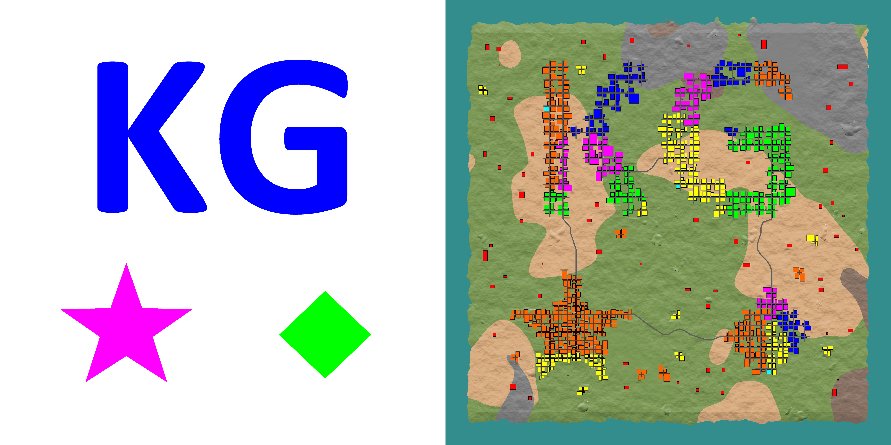
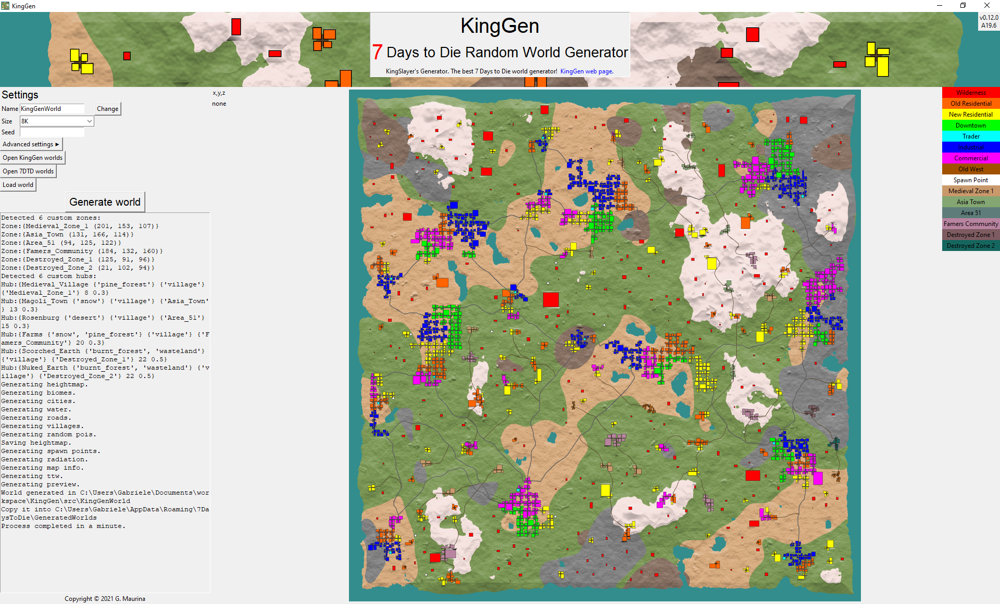

# User Guide

This guide will help you getting started with KingGen. It is advisable to read thoroughly. If you want a nice video tutorial I sugget you check out [@Tallman Brad](https://community.7daystodie.com/profile/93031-tallman-brad/)'s video [here](https://www.youtube.com/watch?v=kR1ExV3aQHY).  
KingGen is a tool to generate worlds that are playable in 7 Days to Die. The generation is procedural, which means that an algorithm will create the world for you. Also every time you run such algorithm, you get a different world. This is great, because you can play the game over and over again in different worlds, without getting bored.

## Getting Started

First off, download KingGen. You can find the download links at the top of this page. KingGen is provided as an executable file for Windows 64 bit and Linux 64 bit. It is packaged inside a single file so that it is easier to distribute. Once you have downloaded KingGen, make sure it is located somewhere on your disk where it has writing permission (like in your home folder), or in alternative run it as administrator. Also make sure that there is enough space available on your disk. This is necessary because KingGen needs to save the generated worlds. Once that is taken care of, it is time to run it.

### Windows

Double-click to start it. Windows might warn you that the publisher is unknown, but you can go ahead and click "run anyway" (buying certificates to be a publisher is expensive).

### Linux

Depending on your distribution, you might just double-click it, or you might have to run it from the terminal. To run it from the terminal open a terminal window at the location of KingGen. Give the file execution permission with:

```sh
chmod +x ./KingGen
```

Fnally run it with: 

```sh
./KingGen
```

Once you have started it, give it a few seconds to load and then the editor will appear.

## Generating First World

To generate your first world using the default settings, simply click on the big button on the left side of the panel that says "Generate World". Now the tool will start and you will be able to see its output log on the left side. The default world is 8K in size and it is called KingGenWorld. Once the generation is completed a folder will appear with the same name of the world and a big preview image will appear on the right side of the panel. The preview image is a map of the newly generated world, in which you can see biomes, mountains, lakes, cities and the traders, which are small rectangles of blue color on the map. A preview image is also saved inside the world folder.

In order to play this world, you have to copy its folder to the 7 Days to Die world folder, which is usually located under  “`%appdata%\Roaming\7 Days to Die\GeneratedWorlds`”. If you don't have this folder  you have to create it manually or you can generate a world from within 7 Days to Die and the game will create the folder for you. Once you have copied the world into this folder, you are ready to fire 7 Days to Die and start a new game. You will find the newly generate world in the worlds list.

### Settings

You you are not satisfied with the default generation, or you just like to mess around and experiment, KingGen offers a lot of options to customize the world as you like. Firt off, on the left side of the panel you can find the basic settings: world name, world size and world seed.

#### Name

The world name is the name of the folder and the name that you will see inside 7 Days to Die. Keep in mind that two worlds cannot have the same name. Also keep in mind that the world is not the saved game and these two can have different names.

#### Size

The world size is either 4K, 8K or 16K. Each of them is a square and their sizes, in blocks, are respectively 4096x4096, 8192x8192 and 16384x16384. Their area is respectively 16Km2, 64Km2 and 256Km2.

#### Seed

The world seed is a sequence of characters that determines the randomness of the generation. Two generations with different seeds, will generate different worlds. Two generation with the same seed will generate the same world. You can put anything you want as seed or you can leave it empty for a random seed.

#### Advanced settings

The advanced settings tab allows you to control the generation more in depth. There are options to control:

*   POIs used and placement. Custom pois are supported
*   Cities, towns and villages generation
*   Landscape generation (biomes, mountains, terrain roughness...)
*   World border
*   Advanced tools
*   Advanced imports (heightmaps, biomes map, cities map...)

## Advanced Customization

### Custom heightmaps

KingGen allows you to import custom heighmaps. You might like to create them yourself or you might have found a cool looking one online, well you are in luck because now you have a way to use them inside the game.

If you want a nice video tutorial for custom maps I suggest you check out [@Tallman Brad](https://community.7daystodie.com/profile/93031-tallman-brad/)'s video [here](https://www.youtube.com/watch?v=z7eEUiPTLi0).

In order to be acceptable, heightmaps must sutisfy some requirements. Heightmaps must be 8-bit or 16-bit, grayscale, png images. Alternatively they can be raw files of the same kind used in the game. The size of heightmaps must be exactly the same as the world you are trying to generate (4096x4096 or 8192x8192 or 16384x16384). If your images do not satisfy these requirements, you might want to use a third party software to convert/adjust it, such as Photoshop or Gimp.  
  
Furthermore there are a few things to keep in mind when designing your own custom heightmap. The world goes from 0 to 255 blocks in height. 0 is the bedrock level and 255 is the build limit. The water level in KingGen is fixed at 43, so any land below that will be submerged. Anything above 100 will be covered in snow. Cities generate only between levels 43 and 70. It is preferable to have flat land around level 60.

### Custom biomes maps

KingGen allows you to import custom biomes maps.

In order to be acceptable, biomes maps must sutisfy some requirements. Biomes maps must be 24-bit (or 32-bit), rbg (or rgba), png images and their size must be exactly the same as the world you are trying to generate.

The colors allowed in biomes maps are:

-  - **pine_forest = 0,64,0**
-  - **snow = 255,255,255**
-  - **desert = 255,228,119**
-  - **burnt_forest = 186,0,255**
-  - **wasteland = 255,168,0**

These are the default colors used by the game.

### Custom cities maps

KingGen allows you to import custom cities maps.

Cities maps are masks that tell KG where and how to generate cities, towns and villages. You can basically draw any shape you want and KG will create a city with that shape. Here is an example:

[](draw_city_example.jpg "Enlarge image")

In order to be acceptable, cities maps must sutisfy some requirements. Cities maps must be 24-bit (or 32-bit), rbg (or rgba), png images and their size must be exactly the same as the world you are trying to generate.

The colors allowed in cities maps are: 

-  - **city = 0,0,255**
-  - **town = 0,255,0**
-  - **village = 255,0,255**
-  - **no pois = 255,0,0**

The "no pois" color prevents KingGen from placing any random pois in that area.

### Custom zoning maps

KingGen allows you to import custom zoning maps. Zones are groups of POIs that are used in hubs. You can think of a zone as a city district, in which the POIs are similar in some way.

Zoning maps are masks that tell KG the type of POIs to use in certain areas. For example industrial buildings vs commercial buildings.

In order to be acceptable, zoning maps must sutisfy some requirements. Zoning maps must be 24-bit (or 32-bit), rbg (or rgba), png images and their size must be exactly the same as the world you are trying to generate.

The colors allowed in zoning maps are:

-  - **old residential = 255,100,0**
-  - **new residential = 255,255,0**
-  - **downtown = 0,255,0**
-  - **industrial = 0,0,255**
-  - **commercial = 255,0,255**
-  - **old west = 161,81,0**


You can use also use custome zones here, with their respective colors. See the Custom Zones section for more information about this.

### Custom water maps

KingGen allows you to import custom water maps. If you do not know about water maps, skip this option, it is not fundamental.

In order to be acceptable, water maps must sutisfy some requirements. Water maps must be 8-bit, grayscale, png images. The size must be exactly the same as the world you are trying to generate (4096x4096 or 8192x8192 or 16384x16384). If your images do not satisfy these requirements, you might want to use a third party software to convert/adjust it, such as Photoshop or Gimp.

Water maps tell KingGen where the water is. The value of each pixel determines the elevation of water in that point. A value of 0 means no water. Water maps merely tell KingGen how to generate the waterinfo.xml file. Water maps **DO NOT** change the heightmap itself. So it is your duty to provide a suitable heightmap along with the water map.

### Custom POIs

KingGen allows you to generate a world with your own custom POIs, including the [Compo-Pack](https://community.7daystodie.com/topic/21900-magolis-compo-pack-current-thread-by-wolfbain5-and-stallionsden/).

If you want a nice video tutorial about custom pois and the Compo Pack I suggest you check out [@Tallman Brad](https://community.7daystodie.com/profile/93031-tallman-brad/)'s video [here](https://www.youtube.com/watch?v=GkB5mo7XqO0&feature=emb_title).

  
KingGen has an internal list of vanilla POIs, taken from the latest version of the game. For the generation you can use this list and KingGen will generate a world only using vanilla POIs. If you want to use Compo-Pack POIs instead, you can check out the [Compo-Pack page](https://community.7daystodie.com/topic/21900-magolis-compo-pack-current-thread-by-wolfbain5-and-stallionsden/) or you can check out the [Compo-Pack discord](https://discord.com/channels/743253634556493874/839636468205223936) for a detailed guide.

  
For any other custom POIs that you might want yo use, you must provide KingGen with a list of comma separated values formatted as follows: each POI must be listed on a new line and be written as `<name>,<x size>,<y size>,<z size>,<y offset>,<rotation to face north>,<allowed biomes>,<allowed townships>,<zones>,<min>,<max>`. Any POI that does not follow this format will be ignored. Here is an example taken from the vanilla list:

```
abandoned\_house\_01,24,18,26,-1,2,burnt\_forest/snow/pine\_forest/desert/wasteland,wilderness/city/town/rural,residentialold,,
abandoned\_house\_02,24,17,25,-1,2,burnt\_forest/snow/pine\_forest/desert/wasteland,wilderness/city/town/rural,residentialold,,
abandoned\_house\_03,21,16,28,-1,2,burnt\_forest/snow/pine\_forest/desert/wasteland,wilderness/city/town/rural,residentialold,,
```

The allowed values for biomes are: `burnt_forest`, `desert`, ` pine_forest`, `snow`, and `wasteland`.

The allowed values for townships are: `city`, `rural`, `town`, and `wilderness`.

The allowed values for zones are: `any`, `downtown`, `commercial`,` industrial`, `oldwest`, `residentialnew`, and `residentialold`.
Any other values will be ignored. Please note that any POI with "`waste`" in their name will be automatically considered a wasteland-only POI. This is to accomodate vanilla's POIs that do not come with a AllowedBiomes property.

**min** means that if at the end of the generation the POI has never been used, it will be added in the wilderness.

**max** means that the POI can be used at most once in the whole world.

**DO NOT** overuse min and max, you will break the generation. Use them only when absolutely necessary.

The character `#` is used to comment lines. Anything on the right hand side of `#` is ignored by KG. You can use comments in the POIs list as follows:

```
abandoned\_house\_01,24,18,26,-1,2,burnt\_forest/snow/pine\_forest/desert/wasteland,wilderness/city/town/rural,residentialold,,
# this line is ignored by KingGen
abandoned\_house\_02,24,17,25,-1,2,burnt\_forest/snow/pine\_forest/desert/wasteland,wilderness/city/town/rural,residentialold,,
```

If you do not want to write one such list by hand, KingGen will generate one for you given a folder containing all the custom POIs. See the advanced setting of the tool for this option.

### Custom Hubs

Hubs are clusters of buildings. There are 3 kinds of hubs: cities, towns and villages. They differ in size, zones and types of pois they contain. Also KG uses them differently during the generation.

In the POIs list you can define custom hubs as follows:

```
@hubs
default\_city,burnt\_forest/snow/pine\_forest/desert/wasteland,city,residentialold/residentialnew/downtown/industrial/commercial,10/20,30/40/50,60/70/80,1,,
default\_single\_city,burnt\_forest/snow/pine\_forest/desert/wasteland,city,residentialold/residentialnew/downtown/industrial/commercial,80/100/120,130/150/170,180/200/220,1,,
default\_town,burnt\_forest/snow/pine\_forest/desert/wasteland,town,residentialold/residentialnew/industrial/commercial,5/10,10/15/20,30/40,1,,
default\_village,burnt\_forest/snow/pine\_forest/desert/wasteland,village,residentialold/residentialnew/commercial,1/2,1/2/3/4/5,6/8/10,1,,
oldwest\_village,desert,village,oldwest,2/3,3/4,4/5,0.5,,
```

The keyword `@hubs` tells KG that from here on hubs are defined and not POIs. (If later in the file you want to go back to define POIs you can use the keyword `@pois`)

Hubs have 6 values: `<name>,<biomes>,<townships>,<zones>,<small\_sizes>,<medium\_sizes>,<large\_sizes>,<prob>,<min>,<max>`

- **name:** name of the hub
- **biomes**: biomes where the hub can be generated
- **townships:** townships of this hub
- **zones:** zones contained by the hub
- **small\_sizes:** number of intersections the hub can have when users selects "small"
- **medium\_sizes:** number of intersectionsthe hub can have when users selects "medium"
- **large\_sizes:** number of intersections the hub can have when users selects "large"
- **prob:** probability of this hub being generated. A number between 0 and 1 is advisable, but it can be exceeded
- **min:** minimum number of times this hub must be generated
- **max:** maximum number of times this hub can be generated

An intersection on average uses 4 POIs.

### Custom Zones

Zones are groups of POIs that are used in hubs. You can think of a zone as a city district, in which the POIs are similar in some way.

In the POIs list you can define custom zones as follows:

```
@zones
residentialold,255,100,0 #orange
residentialnew,255,255,0 #yellow
downtown,0,255,0 #green
industrial,0,0,255 #blue
commercial,255,0,255 #purple
oldwest,161,81,0 #brown
```

The keyword `@zones` tells KG that from here on zones are defined and not POIs. (If later in the file you want to go back to define POIs you can use the keyword `@pois`)

Zones have 4 values: `<name>,<red>,<green>,<blue>`

- **name:** name of the zone
- **red:** red value of rgb color
- **green:** green value of rgb color
- **blue:** blue value of rgb color

The name can be used by POIs to say that they belong to this group. The name can also be used by hubs to say that they contain this zone.

Red, Green and Blue represent the color of this zone, expressed in RGB. Choose the color carefully. Do not use a color already used by the default zones or by the CompoPack.

Here is an example of custom hubs and custom zones using the CompoPack list. You can see custom zones in the top right corner and you can see new colors used in some villages in the generated world.  
[](chub_czone_cp_example.png "Enlarge image")

## World preview

After the generation has completed, the editor will display a preview map of the generated world. A copy of the map is also saved inside the world folder with the name "preview.png". The preview will show you the location of each biome and each POI. POIs are drawn with different colors according to the following table:

-  - **wilderness**
-  - **old residential**
-  - **new residential**
-  - **downtown**
-  - **traders**
-  - **industrial**
-  - **commercial**
-  - **old west**
-  - **spawn point**

## Command line interface (for nerds)

KingGen comes with a command line Interface. This is helpful if you want to automate the generation trough a script to generate lots of worlds.

On `Windows` you can run the tool in a terminal like so:
```sh
./KingGen gen <world name> <size> | more
```

When running the CLI on Windows, always end the command with "`| more`".  
  
On `Linux` you can run the tool in a terminal like so:
```sh
./KingGen gen <world name> <size>
```

More options are available, use "`-h`" to get an help message that lists all of them.

All the map makers tools are available through the GUI and the CLI as well. The tools are accessed with the following subcommands:

- `gen`
- `poislist`
- `pngraw`
- `rawpng16`
- `rawpng8`
- `biomesfix`
- `splatfix`
- `preview`

To get a specific help message for a subcommand, use "`-h`" option after the subcommand.

> **Edited August 13 by KingSlayerGM** [(see edit history)](https://community.7daystodie.com/topic/23988-kinggen-a-random-world-generator-for-7-days-to-die/?do=editlogComment&comment=424160 "see edit history")